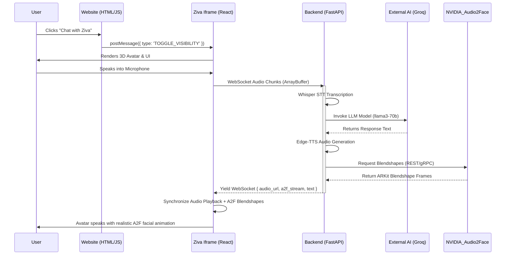

# YatraSathi - AI Travel Planning Platform

YatraSathi is an AI-powered travel planning platform backend built with FastAPI and Python 3.10. It features itinerary generation, attraction discovery, hotel recommendations, and a conversational travel assistant using Groq LLM and FAISS for vector search.

## Features

- **Trip Management**: Create and manage trips with destinations, dates, budgets, and interests.
- **AI Itinerary Generator**: Auto-generate optimized day-wise travel plans based on Groq LLM, geospatial clustering, and route optimization.
- **Attraction Discovery**: Fetch landmarks and tourist locations.
- **Hotel Recommendation System**: Suggest accommodations based on location and budget.
- **Conversational Travel Assistant**: Ask questions and get customized travel plans and advice.
- **Ziva AI Avatar**: Real-time multilingual conversational AI avatar using Faster-Whisper STT, Edge-TTS, Redis Caching for ultra-low latency, and Three.js for interactive 3D rendering (GLB animations) over WebSockets.
- **RAG Knowledge Base**: Uses FAISS vector search to retrieve travel context efficiently.
- **NVIDIA Audio2Face Integration**: Production-grade facial animation and ARKit blendshape lip-sync streaming via local A2F headless server.

## Architecture


YatraSathi uses a highly optimized **Hybrid Micro-Frontend Architecture**:

1. **Website Frontend (Port 3000)**: A lightweight, fast, SEO-friendly HTML/JS application handling core navigation, travel dashboards, and static marketing content.
2. **React Chatbot System (Port 5173)**: An isolated React + Vite application handling heavy 3D rendering (Ziva Avatar), Web Audio API, real-time A2F blendshape interpolation, and WebSocket communication. It is embedded dynamically into the Website via an iframe and controlled via `postMessage`.
3. **FastAPI Backend (Port 8000)**: An async event-driven Python server processing STT (Whisper), LLM generation, TTS (Edge-TTS), and RAG vector searches.

Below is the high-level system interaction architecture:



## Prerequisites

- [Docker](https://docs.docker.com/get-docker/) & Docker Compose
- Or locally: Python 3.10+, PostgreSQL, Redis (running locally on port 6379, optional but recommended)
- **FFmpeg**: Required in system PATH for audio/video processing and TTS.
- **NVIDIA Omniverse & Audio2Face**: Required for real-time facial animation generation (run headless on port 8011).
- **3D Assets**: `Ziva.glb`, `Animations.glb`, and `Snepard.glb` placed in `frontend/assets/model/`.

## Setup and Installation

### Running with Docker (Recommended)

1. Clone the repository.
2. Create a `.env` file in the `backend` directory with your Groq API key:
   ```env
   GROQ_API_KEY=your_groq_api_key_here
   ```
3. Run the application using Docker Compose at the root of the project:
   ```bash
   docker-compose up --build
   ```

### Running Locally without Docker

For detailed step-by-step instructions, please see [Setup.md](Setup.md).

1. Go to the backend directory:
   ```bash
   cd backend
   ```
2. Create a virtual environment and install dependencies:
   ```bash
   python -m venv venv
   # On Windows
   venv\Scripts\activate
   # On Linux/MacOS
   source venv/bin/activate
   pip install -r requirements.txt
   ```
3. Set your environment variables in `.env`:
   ```env
   GROQ_API_KEY=your_groq_api_key_here
   OPENWEATHERMAP_API_KEY=your_openweathermap_api_key
   SECRET_KEY=your_jwt_secret
   AUDIO2FACE_URL=http://localhost:8011
   ```
   *(Note: The database is a local JSON file at `backend/data/database.json`, so no external DB setup is required.)*
4. **Seed the RAG Knowledge Base** (Crucial step for City Insights & Itinerary planning):
   ```bash
   python -m data.seed_rag
   ```
5. Start the FastAPI server:
   ```bash
   python -m uvicorn main:app --host 0.0.0.0 --port 8000 --reload
   ```

## API Documentation

Once the app is running, interactive API documentation is automatically generated by FastAPI and can be accessed at:
- Swagger UI: `http://localhost:8000/docs`
- ReDoc: `http://localhost:8000/redoc`

## Project Structure

```text
YatraSathi/
├── frontend/                     # Main Web Application (Port 3000)
│   ├── index.html                # Landing Page
│   ├── home.html                 # Dashboard (Hosts React Iframe)
│   └── js/
│       └── iframe-bridge.js      # PostMessage communication bridge
├── react-chatbot/                # 3D Avatar & Chat UI (Port 5173)
│   ├── public/
│   │   └── models/               # Ziva.glb, Animations.glb
│   └── src/
│       ├── store/                # Zustand State Management
│       ├── avatar/               # R3F Experience & Lipsync Logic
│       ├── websocket/            # Backend Socket Connection
│       └── components/           # ChatOverlay & Framer Motion UI
├── backend/                      # FastAPI AI Engine (Port 8000)
│   ├── app/                      
│   │   ├── api/                  # REST and WebSocket endpoints
│   │   ├── services/             # Pipeline: STT, LLM, TTS, Lipsync
│   │   ├── models/               # Database Models
│   │   └── rag/                  # Vector Store integration
│   ├── data/
│   │   ├── cache/                # Statically mounted TTS Audio outputs
│   │   └── temp/                 # Ephemeral WebSocket incoming audio
│   └── main.py                   # Application Entrypoint
└── docker-compose.yml            # Container Orchestration
```
