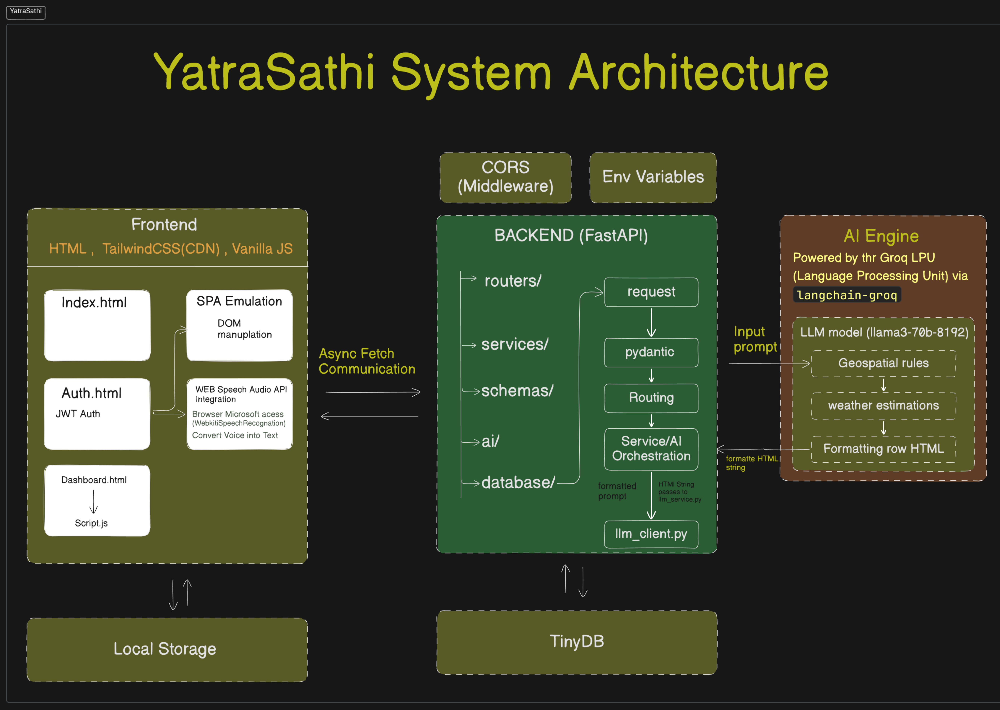
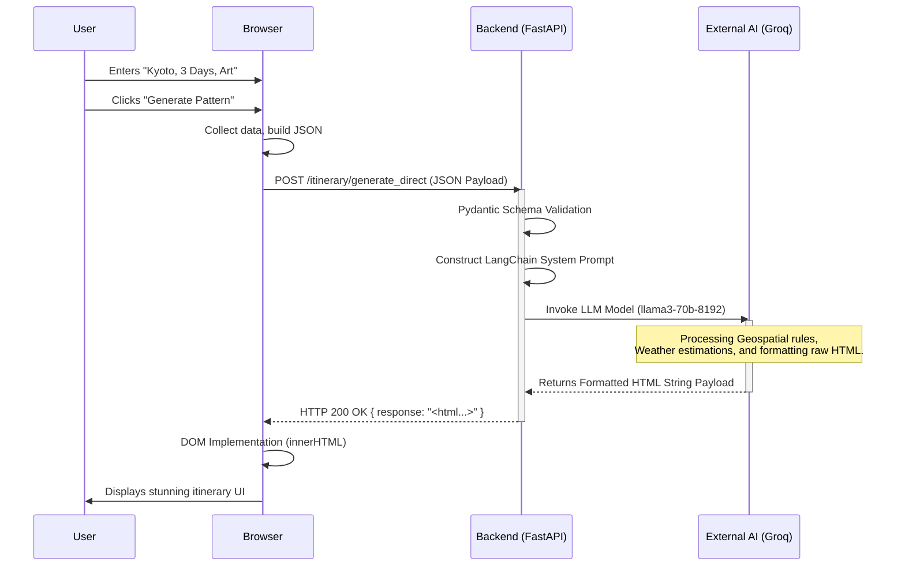

# YatraSathi - AI Travel Planning Platform

YatraSathi is an AI-powered travel planning platform backend built with FastAPI and Python 3.10. It features itinerary generation, attraction discovery, hotel recommendations, and a conversational travel assistant using Groq LLM and FAISS for vector search.

## Features

- **Trip Management**: Create and manage trips with destinations, dates, budgets, and interests.
- **AI Itinerary Generator**: Auto-generate optimized day-wise travel plans based on Groq LLM, geospatial clustering, and route optimization.
- **Attraction Discovery**: Fetch landmarks and tourist locations.
- **Hotel Recommendation System**: Suggest accommodations based on location and budget.
- **Conversational Travel Assistant**: Ask questions and get customized travel plans and advice.
- **RAG Knowledge Base**: Uses FAISS vector search to retrieve travel context efficiently.

## Architecture



Below is the high-level system interaction architecture for YatraSathi's core planning features:



## Prerequisites

- [Docker](https://docs.docker.com/get-docker/) & Docker Compose
- Or locally: Python 3.10+, PostgreSQL, Redis

## Setup and Installation

### Running with Docker (Recommended)

1. Clone the repository.
2. Create a `.env` file in the `backend` directory with your Groq API key:
   ```env
   GROQ_API_KEY=your_groq_api_key_here
   ```
3. Run the application using Docker Compose at the root of the project:
   ```bash
   docker-compose up --build
   ```

### Running Locally without Docker

For detailed step-by-step instructions, please see [Setup.md](Setup.md).

1. Go to the backend directory:
   ```bash
   cd backend
   ```
2. Create a virtual environment and install dependencies:
   ```bash
   python -m venv venv
   # On Windows
   venv\Scripts\activate
   # On Linux/MacOS
   source venv/bin/activate
   pip install -r requirements.txt
   ```
3. Set your environment variables in `.env`:
   ```env
   GROQ_API_KEY=your_groq_api_key_here
   OPENWEATHERMAP_API_KEY=your_openweathermap_api_key
   SECRET_KEY=your_jwt_secret
   ```
   *(Note: The database is a local JSON file at `backend/data/database.json`, so no external DB setup is required.)*
4. **Seed the RAG Knowledge Base** (Crucial step for City Insights & Itinerary planning):
   ```bash
   python -m data.seed_rag
   ```
5. Start the FastAPI server:
   ```bash
   python -m uvicorn main:app --host 0.0.0.0 --port 8000 --reload
   ```

## API Documentation

Once the app is running, interactive API documentation is automatically generated by FastAPI and can be accessed at:
- Swagger UI: `http://localhost:8000/docs`
- ReDoc: `http://localhost:8000/redoc`

## Project Structure

```text
YatraSathi/
├── docker-compose.yml     # Orchestrates DB, Redis, and overall App
├── backend/
│   ├── app/               # FastAPI Application logic
│   │   ├── ai/            # Groq LLM integration and Agent Tools
│   │   ├── models/        # SQLAlchemy Database Models
│   │   ├── routers/       # API endpoints (controllers)
│   │   ├── schemas/       # Pydantic schemas (validation)
│   │   ├── services/      # Business logic
│   │   ├── utils/         # Helper functions (Geo, clustering)
│   │   ├── vector_store/  # FAISS Vector indexing
│   │   ├── config.py      # Environment variables configuration
│   │   └── main.py        # Entry point
│   ├── Dockerfile         # Docker Image definition for API
│   ├── requirements.txt   # Python Dependencies
│   └── .env               # Secrets configuration
└── frontend/              # Web application
```
