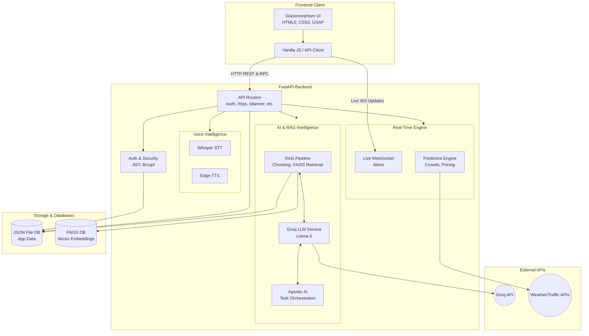

# YatraSaathi — Complete Architecture & Technical Details

## System Architecture Diagram

## 1. Tech Stack & Libraries

### 1.1 Backend Dependencies (`requirements.txt`)
- **FastAPI (`fastapi==0.103.2`, `uvicorn[standard]==0.23.2`)**: High-performance web framework for APIs.
- **Pydantic (`pydantic==2.4.2`, `pydantic-settings==2.0.3`)**: Data validation and settings management using Python type annotations.
- **Security & Auth**:
  - `python-jose[cryptography]==3.3.0`: JWT token generation and validation.
  - `passlib[bcrypt]==1.7.4`: Password hashing.
  - `cryptography==41.0.5`: Cryptographic recipes and primitives.
- **AI & RAG Pipeline**:
  - `sentence-transformers>=2.7.0`: Generating semantic text embeddings.
  - `faiss-cpu==1.13.2`: Facebook AI Similarity Search for local vector database.
  - `torch`, `torchvision`, `torchaudio`: Deep learning framework required by sentence-transformers and Whisper.
- **External API & Scraping**:
  - `httpx==0.25.0`: Async HTTP client.
  - `beautifulsoup4`: HTML parsing for web scraping.
- **Voice Intelligence**:
  - `openai-whisper==20231117`: Speech-to-text transcription.
  - `edge-tts==6.1.9`: Text-to-speech generation.
- **Real-Time Communication**:
  - `websockets==12.0`: WebSocket support for live updates.
- **Utilities**:
  - `python-multipart==0.0.6`: Form data parsing.
  - `python-dotenv==1.0.0`: Environment variable management.
  - `pytz==2023.3`: Timezone handling.
  - `aiofiles==23.2.1`: Asynchronous file I/O operations.
  - `email-validator==2.0.0`: Email address validation.

### 1.2 Frontend Technologies
- **Core**: HTML5, CSS3, Vanilla JavaScript.
- **Styling**: Custom CSS with CSS Variables, Flexbox, CSS Grid. Glassmorphism UI (frosted glass effects via `backdrop-filter`).
- **Animations**: GSAP (`gsap.min.js`) for complex and smooth UI animations.
- **Icons**: FontAwesome 6.5.0 (`all.min.css`).
- **Components**: Floating Dock Navigation, Morphing Scroll Navbar, Interactive Multi-step Forms, Dynamic Modals.

---

## 2. API Architecture & CRUD Methods

All endpoints are hosted under the `/api/v1` prefix. The backend follows a RESTful pattern heavily augmented with RPC-style generative endpoints for AI tasks.

### Authentication (`/auth`)
- **POST** `/auth/signup` (Create): Register a new user. Returns `UserResponse`.
- **POST** `/auth/login` (Read/Create Session): Authenticate user and generate JWT token.

### Trip Management (`/trips`)
- **POST** `/trips/create` (Create): Save a newly generated trip itinerary to the user's account.
- **GET** `/trips/my-trips` (Read): Retrieve all trips belonging to the authenticated user.
- **GET** `/trips/{trip_id}` (Read): Fetch details of a specific trip by its ID.
- **DELETE** `/trips/{trip_id}` (Delete): Remove a specific trip.

### AI Trip Planner (`/planner`)
- **POST** `/planner/generate-trip` (Create): Trigger the RAG-grounded AI engine to generate a personalized itinerary based on form inputs.

### City Insights (`/city`)
- **POST** `/city/city-insights` (Read/Generate): Retrieve RAG-based intelligence for a specific city.
- **GET** `/city/city-image` (Read): Fetch images related to a city.
- **GET** `/city/live-info` (Read): Fetch live, localized info for a city.

### Weather Intelligence (`/weather`)
- **GET** `/weather/` (Read): Retrieve live weather forecasts and data.

### Expense Tracking (`/expenses`)
- **POST** `/expenses/add` (Create): Add an AI-categorized expense to a trip.
- **GET** `/expenses/trip/{trip_id}` (Read): Retrieve all expenses associated with a specific trip.

### Budget Intelligence (`/budget`)
- **POST** `/budget/analyze` (Create/Read): Analyze trip expenses and generate a full financial dashboard report, including LLM advice.

### Conversational AI & Agents
- **POST** `/conversation/chat` (Create): Chat with the AI travel assistant (intent → agent routing).
- **POST** `/translate/text` (Create): Multilingual text translation.
- **POST** `/agent/task` (Create): Direct dispatch to a specific AI agent (Planner, Budget, Safety).
- **POST** `/intent/analyze` (Create): Detect user intent from text.

### Voice Intelligence (`/voice`)
- **POST** `/voice/transcribe` (Create): Whisper STT - Convert audio to text.
- **POST** `/voice/respond` (Create): Edge-TTS - Generate voice response.

### Predictive Intelligence
- **POST** `/predict/crowd` (Read/Generate): Predict crowd levels at a location.
- **POST** `/predict/pricing` (Read/Generate): Predict pricing surges (flights/hotels).
- **POST** `/predict/weather` (Read/Generate): Predictive weather impact.
- **GET** `/metrics/summary` (Read): Get system predictive metrics summary.

### Ecosystem & Multimodal
- **POST** `/multimodal/analyze` (Create): Analyze complex inputs (text + image).
- **POST** `/ocr/scan` (Create): Extract text from images (e.g., receipts).
- **POST** `/vision/understand` (Create): Image understanding.
- **POST** `/autonomous/optimize` (Create): Auto-optimize trip plans.
- **POST** `/autonomous/evaluate` (Create): Evaluate current plans autonomously.
- **POST** `/currency/convert` (Read/Generate): Live currency conversion.
- **GET** `/global/timezone/{city}` (Read): Get timezone for a city.
- **GET** `/global/region/{country}` (Read): Get region info.
- **POST** `/group/create` (Create): Create a group trip.
- **GET** `/group/{group_id}` (Read): Get group trip details.
- **POST** `/group/vote` (Create): Submit a vote in a group trip.
- **POST** `/group/split` (Create): Split expenses among group members.
- **POST** `/wearable/notify` (Create): Push notification to wearable devices.

### Super AI OS
- **POST** `/super/chat` (Create): Super AI holistic chat interface.
- **POST** `/super/emotional-check` (Create): Analyze user sentiment/emotion.
- **GET** `/super/profile/{user_id}` (Read): Retrieve deep user profile.
- **POST** `/super/risk-assessment` (Create): Assess risks for a planned route.
- **POST** `/mobility/recommend` (Create): Recommend transit options.
- **POST** `/mobility/navigate` (Create): Real-time navigation routing.
- **POST** `/memory/store` (Create): Store user preferences to memory.
- **GET** `/memory/recall` (Read): Recall user preferences from memory.
- **POST** `/feedback/recommendation` (Create): Provide feedback to the AI.
- **POST** `/simulate/trip` (Create): Run a full trip simulation.
- **POST** `/simulate/scenario` (Create): Simulate specific disruptions (e.g., flight delay).
- **GET** `/events/{city}` (Read): Get local events for a city.

### Live WebSockets
- **WS** `/ws/{user_id}`: Live WebSocket connection for real-time alerts and notifications.

### Health & Monitoring
- **GET** `/health` (Read): Standard health check.
- **GET** `/metrics` (Read): System metrics for monitoring.

---

## 3. Backend System Architecture (Phases)

### Phase 2: Core API Infrastructure
- **`main.py`**: Entry point, lifespan management, CORS, Middlewares.
- **`config/`**: Configuration via Pydantic (`settings.py`), Async JSON DB interface (`database.py`).
- **`auth/`**: Security handling, Bcrypt hashing, JWT issuance and validation.
- **`schemas/`**: Pydantic models for request validation and response formatting.
- **`routes/`**: FastAPI routers mapping to endpoint logic.

### Phase 3: RAG & AI Intelligence
- **`rag/`**: Handles document chunking, embedding generation (SentenceTransformers), local FAISS vector store management, hybrid search, ranking, and memory/context retrieval.
- **`ai/`**: Groq LLM integration (`llm_service.py`), prompt engineering, and intelligent modules for itinerary generation and personalized recommendations.

### Phase 4: Real-Time Intelligence
- **`services/`**: Integration with external APIs (Weather, Traffic, Events, Pricing).
- **`realtime/`**: Engines analyzing live data impacts and triggering WebSocket notifications.
- **`orchestration/`**: Decision engines aggregating signals to adapt and optimize plans.
- **`ws_handler/`**: Manages active WebSocket connections.

### Phase 5: Budget Financial Intelligence
- **`budget/`**: Modules for expense tracking, pricing analysis, scam detection, overspending alerts, and generating dashboard analytics via LLM financial advisors.

### Phase 6: Voice, Translation & Agentic AI
- **`voice/`**: Whisper STT and Edge-TTS integration, wakeword preparation.
- **`translation/`**: Language detection and multilingual response formatting.
- **`conversation/`**: Memory and context engines for fluid dialogue.
- **`agentic/`**: Specialized autonomous agents (Planner, Budget, Safety, Booking) orchestrated by a master task manager.

---

## 4. Database & Storage Strategy
YatraSaathi employs a lightweight, local-first storage mechanism designed for rapid prototyping and simplified deployment:
- **Relational/Document Data**: Stored in a JSON File DB (`data/db.json`). Supports basic async Read/Write operations without needing PostgreSQL/MongoDB.
- **Vector Store**: Local persistent FAISS database for lightning-fast semantic search across chunked destination/travel data.
