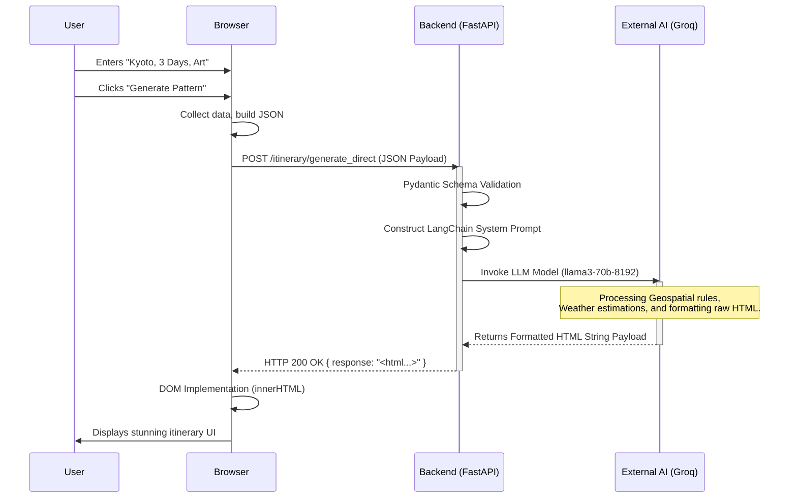
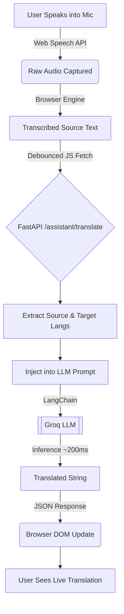

# YatraSathi System Architecture

This document provides a highly detailed architectural overview of the **YatraSathi** AI Travel Companion application. Designed for scale, speed, and deep AI-integration, YatraSathi leverages modern decoupling and cloud LLM capabilities to deliver a seamless user experience.

---

## 🏗️ 1. High-Level Architecture Overview

YatraSathi follows a **Classic Client-Server (Decoupled)** architecture, integrated with external Generative AI services.

*   **Frontend (Client):** A lightweight Javascript/HTML Single Page Application (SPA)-style dashboard powered by modern Tailwind CSS for sleek UI styling and immediate rendering. No heavy frontend frameworks are used, ensuring blazing fast load times.
*   **Backend (Server):** A high-performance async API server built on **FastAPI** (Python 3.10+). It handles complex routing, schema validation, and acts as the orchestrator between the client and the LLM.
*   **AI Engine (External Service):** Powered by the **Groq LPU (Language Processing Unit)** via `langchain-groq`. The system achieves near-instantaneous LLM responses required for real-time applications like live voice translation and rapid itinerary generation.
*   **Database (Persistence):** **TinyDB** acts as the local lightweight document store for structured backend data, while standard browser `localStorage` acts as a rapid-access cache/store for client-side user sessions.

---

## 🧠 2. Deep Dive: Component Architecture

### 2.1 Frontend Architecture (The Presentation Layer)
The frontend is strictly built using pure standard web technologies to achieve zero-bundle constraint. 

**Core Technologies:** `HTML5`, `Vanilla JavaScript`, `TailwindCSS (CDN)`.

*   **Index (`index.html`):** The landing page. Handles marketing, SEO, and user introduction. Heavily styled with Tailwind CSS grid layers and Glassmorphism effects.
*   **Auth (`auth.html`):** The Gateway. Manages simulated user session creations logic via Javascript, writing session tokens directly to `localStorage`.
*   **Dashboard (`dashboard.html` & `script.js`):** The Core Application. 
    *   **SPA Emulation:** Uses JavaScript DOM manipulation to hide/reveal `<section id="view-...">` blocks instantly without reloading the page.
    *   **Web Speech API Integration:** Taps into browser-native microphone access (`webkitSpeechRecognition`) to harvest user voice data, convert it to text on the fly, and fire off async translation requests.
    *   **Asynchronous Fetching:** Fully async `fetch()` logic communicating with FastAPI endpoints. Handles debouncing for the live translator to avoid rate-limiting the LLM.

### 2.2 Backend Architecture (The Logic & Integration Layer)
Built with **FastAPI**, the backend leverages Python's pure asynchronous capabilities (`asyncio`) yielding non-blocking connections vital for live streaming AI output.

**Stack:** `FastAPI`, `Uvicorn`, `Pydantic`, `Langchain`, `Groq`.

**Directory Structure Design (Domain-Driven):**
```text
backend/
├── app/
│   ├── main.py                 # The ASGI Application Entry Point
│   ├── routers/                # Controller layer mapping HTTP verbs to functions
│   │   ├── itinerary_router.py # Handles generating trip plans
│   │   ├── assistant_router.py # Handles translation and chat 
│   ├── services/               # The core Business Logic
│   │   ├── prompt_engineering/ # LLM Prompt formulation
│   │   ├── itinerary_service.py# Data assembly for routing
│   ├── schemas/                # Pydantic validation models (Data Contracts)
│   ├── ai/                     # Langchain/Groq Client wrappers
│   └── database/               # TinyDB ORM representations
└── requirements.txt
```

**Workflow of an API Call (e.g., Plan Trip):**
1.  **Request:** Frontend `fetch` POST to `/itinerary/generate_direct`.
2.  **Validation:** Request payload triggers `DirectItineraryRequest` Pydantic schema validation. If invalid, FastAPI auto-returns a `422 Unprocessable Entity`.
3.  **Routing:** `itinerary_router` receives the validated JSON and passes the arguments to `itinerary_service.py`.
4.  **Service / AI Orchestration:**
    *   The service formulates a strictly structured prompt requesting an **HTML-formatted** string.
    *   It passes the prompt to `llm_client.py` (`Langchain` wrapped `ChatGroq` model).
5.  **Execution:** The LLM analyzes the destination, correlates it with real-time assumptions, generates the optimized text natively mapped into HTML tags, and returns it.
6.  **Response:** The router wraps the raw LLM string into a successful JSON response mapped back down the HTTP pipeline to the JS client.

---

## 🎨 3. UI/UX Design System (Tailwind)
The system UI is orchestrated to feel alive, modern, and high-tech.
*   **Color Palette:** Neon Cyber/Travel aesthetics. 
    *   *Primary:* `#00f2fe`
    *   *Accent:* `#facc15`
    *   *Dark Surface:* `#111827`
*   **Typography:** Google's `Outfit` font, known for geometric sans-serif legibility and modern tech feel.
*   **Animations:** Custom CSS Keyframes married with Tailwind utility classes (`group-hover:scale-110`, `backdrop-blur-2xl`, `bg-gradient-to-r`).
*   **Component Modularity:** Forms utilize floating labels, absolute-positioned translucent glowing borders, and heavy drop shadows simulating physical depth.

---

## 🗺️ 4. Mermaid Flow Diagrams

### 4.1 System Interaction Map (The "Plan Trip" Flow)


### 4.2 The Real-Time Voice Translation Flow


---

## 🔐 5. Security & Persistence Strategies

**Current Implementations:**
*   **CORS (Cross-Origin Resource Sharing):** Enabled on FastAPI via `CORSMiddleware` to allow `localhost` and `127.0.0.1` origins, decoupling the frontend completely from the backend's port.
*   **Environment Variables:** Groq API keys are completely internalized in `.env` handled by `python-dotenv`. Keys are never exposed payload responses or frontend scripts.
*   **Storage - Local:** 
    *   `yatrasathi_user` object in `localStorage` caches visual session state.
    *   Future implementation will map this to `TinyDB` persistent storage for user login retrieval.

## 🚀 6. Future Architectural Scalability Paths
1.  **WebSockets for Translation:** Transition the polling/debounced `fetch` on the live translator to `FastAPI WebSockets` for true bi-directional audio/text streaming.
2.  **Vector Database Routing:** Currently, LLM contextualizes entirely via Prompt Engineering. Adding `ChromaDB` or `Pinecone` could let YatraSathi query external RAG architectures (Retrieval-Augmented Generation) for precise local hidden gem articles.
3.  **Containerization:** Wrapping the Frontend in Nginx and the Backend in Uvicorn into docker containers using `docker-compose.yml`.
